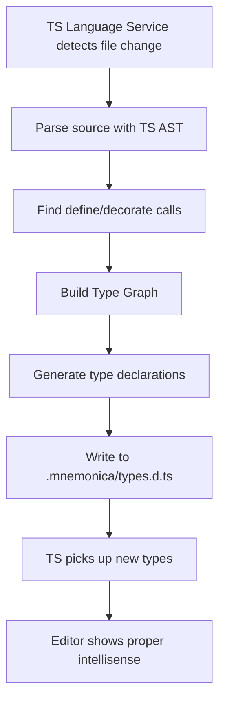

# Tactica: TypeScript Language Service Plugin for Mnemonica

## Overview

Tactica is a TypeScript Language Service Plugin that generates type definitions for Mnemonica's dynamic nested constructors. It enables TypeScript to understand the runtime type hierarchy created through `define()` and `decorate()` calls.

## Problem Statement

In Mnemonica, types are created dynamically at runtime:

```typescript
const FirstType = define('FirstType', function (this: { first: string }) {
    this.first = 'FirstType';
});

const SecondType = FirstType.define('SecondType', function (this: { second: string }) {
    this.second = 'SecondType';
});

const first = new FirstType();
const second = new first.SecondType(); // Works at runtime, but TypeScript doesn't know about .SecondType
```

Currently, TypeScript cannot infer that `first.SecondType` exists because:
1. `FirstType.define('SecondType', ...)` is a runtime operation
2. The type system has no knowledge of this relationship
3. Users must use workarounds like `apply(first, SecondType)` or type casting

## Solution Architecture

### 1. TypeScript Language Service Plugin

The plugin integrates with TypeScript's language service to:
- Parse source files using TypeScript's AST
- Detect all `define()` and `decorate()` calls
- Build a type graph representing the hierarchy
- Generate declaration files in `.mnemonica/` folder

### 2. Type Graph (Trie Structure)

```
TypeHierarchy
├── FirstType
│   ├── instanceProperties: { first: string }
│   ├── SecondType
│   │   ├── instanceProperties: { first: undefined, second: string }
│   │   └── ...
│   └── ...
└── ...
```

### 3. Generated Output

The plugin generates types in `.mnemonica/types.d.ts`:

```typescript
// Generated by tactica - DO NOT EDIT
import { IDefinitorInstance, MnemonicaInstance, SN } from 'mnemonica';

// Type hierarchy declaration
interface MnemonicaTypeRegistry {
  FirstType: {
    properties: { first: string };
    subtypes: {
      SecondType: {
        properties: { first: undefined; second: string };
        subtypes: {};
      };
    };
  };
}

// Augmented instance types
declare module 'mnemonica' {
  interface FirstTypeInstance extends MnemonicaInstance {
    SecondType: IDefinitorInstance<
      { first: undefined; second: string } & FirstTypeInstance,
      SN
    >;
  }
}
```

## Core Components

### 1. Plugin Entry Point (`src/index.ts`)

Implements TypeScript's Language Service Plugin interface:
- `create()` - Initialize the plugin
- `onConfigurationChanged()` - React to config changes
- File change detection

### 2. AST Analyzer (`src/analyzer.ts`)

Uses TypeScript's compiler API to:
- Find all `define()` calls
- Find all `decorate()` decorator applications
- Extract type names and property definitions
- Build the type graph

### 3. Type Graph (`src/graph.ts`)

Trie-based data structure:
```typescript
interface TypeNode {
  name: string;
  fullPath: string;  // e.g., "FirstType.SecondType"
  properties: Record<string, TypeInfo>;
  parent?: TypeNode;
  children: Map<string, TypeNode>;
  sourceFile: string;
  position: { line: number; column: number };
}
```

### 4. Code Generator (`src/generator.ts`)

Generates TypeScript declarations from the type graph:
- Module augmentations for mnemonica
- Instance type interfaces with nested constructors
- Proper handling of property inheritance

### 5. File Writer (`src/writer.ts`)

- Creates `.mnemonica/` directory
- Writes `types.d.ts`
- Updates `.gitignore` if needed
- Handles incremental updates

## Workflow



## Configuration

### tsconfig.json

```json
{
  "compilerOptions": {
    "plugins": [
      {
        "name": "@mnemonica/tactica",
        "outputDir": ".mnemonica",
        "include": ["src/**/*.ts"],
        "exclude": ["**/*.test.ts"]
      }
    ]
  }
}
```

### package.json

```json
{
  "devDependencies": {
    "@mnemonica/tactica": "^0.1.0"
  }
}
```

## Benefits

1. **Type Safety**: Proper type inference for nested constructors
2. **IDE Support**: IntelliSense and autocomplete for `instance.SubType`
3. **No Runtime Changes**: Purely a development-time tool
4. **Automatic Updates**: Regenerates types on file changes
5. **Clean Mnemonica Core**: Removes need for `[string]: () => unknown` workarounds

## Example Usage

### Before (Current Pattern)

```typescript
const FirstType = define('FirstType', function (this: { first: string }) {
    this.first = 'FirstType';
});

const SecondType = FirstType.define('SecondType', function (this: { second: string }) {
    this.second = 'SecondType';
});

const first = new FirstType();

// TypeScript doesn't know about first.SecondType
// Must use apply() or type casting
const second = apply(first, SecondType);
// or
const second2 = new first.SecondType() as unknown as InstanceType<typeof SecondType>;
```

### After (With Tactica)

```typescript
const FirstType = define('FirstType', function (this: { first: string }) {
    this.first = 'FirstType';
});

const SecondType = FirstType.define('SecondType', function (this: { second: string }) {
    this.second = 'SecondType';
});

const first = new FirstType();

// TypeScript knows first.SecondType exists!
const second = new first.SecondType();  // ✓ Properly typed
second.second;  // ✓ string
second.first;   // ✓ inherited from FirstType
```

## Integration with Existing Mnemonica Ecosystem

### Relationship to Topologica
- Topologica: Filesystem-based type discovery
- Tactica: TypeScript-aware type generation
- Future: Tactica could be extended to understand topologica's directory structure

### Changes to Mnemonica Core

The plugin enables removing or deprecating:
```typescript
// Current workaround in Mnemonica types
[key: string]: unknown;  // Can be removed with proper type generation
```

## Implementation Phases

### Phase 1: Basic Plugin ✓ COMPLETED
- [x] Plugin skeleton with TS Language Service integration
- [x] AST analyzer for `define()` calls
- [x] Simple type graph
- [x] Basic `.d.ts` generation

### Phase 2: Advanced Features ✓ COMPLETED
- [x] Support for `decorate()` decorator
- [x] Property inheritance tracking
- [x] Incremental updates
- [x] Configuration options

### Phase 3: Polish ✓ COMPLETED
- [x] Error handling
- [x] Performance optimization
- [x] Documentation
- [x] Test suite (23 tests passing)

## Future Enhancements (Not Implemented)

### Phase 4: Advanced Analysis
- [ ] Better parent-child relationship resolution using full TypeScript program binding
- [ ] Support for complex property patterns (computed properties, getters/setters)
- [ ] Cross-file type reference resolution
- [ ] Support for generic type parameters in mnemonica types

### Phase 5: IDE Integration
- [ ] VS Code extension for better UX
- [ ] Inline diagnostics for mnemonica-specific issues
- [ ] Go-to-definition for generated types
- [ ] Rename refactoring support

### Phase 6: Ecosystem Integration
- [ ] Topologica integration (understand directory structure)
- [ ] Webpack/Vite plugin for build-time generation
- [ ] ESLint rules for mnemonica patterns
- [ ] Migration tool for existing codebases

### Phase 7: Performance & Scale
- [ ] Incremental compilation for large codebases
- [ ] Caching of parsed AST
- [ ] Parallel processing of multiple files
- [ ] Memory optimization for long-running language service

## Technical Constraints

1. Must work with TypeScript 5.x
2. Must not require changes to Mnemonica runtime
3. Must handle circular dependencies gracefully
4. Must support both CommonJS and ESM projects
5. Must work with existing Mnemonica type definitions

## Project Status

**Current Status**: MVP Complete - All core features implemented and tested

**Test Coverage**: 23 tests passing covering:
- AST analysis for `define()` and `decorate()`
- Type graph construction
- TypeScript declaration generation
- File writing and `.gitignore` management
- Integration with real mnemonica patterns

**Known Limitations**:
1. Single-pass analysis without full TypeScript program may miss some parent-child relationships
2. Property extraction limited to `Object.assign()` and direct assignment patterns
3. No support for complex decorator patterns yet

## Next Steps

1. ~~Review and approve this plan~~ ✓ Done
2. ~~Set up project structure in `tactica/` folder~~ ✓ Done
3. ~~Implement Phase 1 components~~ ✓ Done
4. ~~Test with `core/test-ts/test-example.ts` pattern~~ ✓ Done
5. ~~Iterate based on feedback~~ ✓ Done

### Future Work
- [ ] Test on real-world mnemonica projects
- [ ] Gather user feedback on type generation accuracy
- [ ] Implement Phase 4 enhancements as needed
- [ ] Consider VS Code extension for better UX
